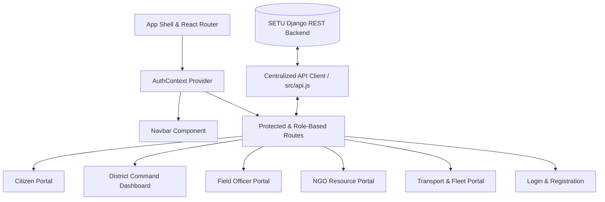

# SETU Frontend Application — Comprehensive Team Brief

## 1. Executive Summary
The **SETU Frontend Application** is a unified, real-time disaster management and relief coordination platform built for the North-Eastern Region (NER) of India. It bridges citizens, district administrators, field officers, non-governmental organizations (NGOs), and transport/logistics operators under a single, role-adaptive web application.

The project has transitioned from prototype modules into a **production-ready Vite + React single-page application (SPA)** integrated directly with the Django REST Framework (DRF) backend services, real-time GIS mapping (Leaflet), and Tailwind CSS design components.

---

## 2. Technology Stack & Architecture

| Layer | Technologies / Libraries |
|---|---|
| **Core Framework** | React 18 (ESM), Vite 5 |
| **Routing** | React Router DOM v6 |
| **State & Auth Management** | React Context API (`AuthContext`), LocalStorage Persistence |
| **HTTP & API Service Layer** | Axios with interceptors, Bearer Token Auth |
| **UI & Styling** | Tailwind CSS v3, PostCSS, Autoprefixer, Lucide React Icons, Clsx, Tailwind Merge |
| **Mapping & GIS** | Leaflet.js, React-Leaflet v4 |
| **Deployment & Containers** | Docker (Node 20 Alpine), NGINX / Vite Dev Server |

---

## 3. Core Modules & Subsystems



### 3.1 Authentication & Role-Based Authorization
- **JWT Token Lifecycle**: Supports access (60 min) and refresh (7 days) token storage in `localStorage`.
- **Role-Based Interfaces**: Dynamically renders portal views based on the authenticated user's role:
  - `CITIZEN` (`citizen`)
  - `DISTRICT_OFFICER` (`district_admin`)
  - `FIELD_OFFICER` (`field_officer`)
  - `NGO` (`ngo`)
  - `TRANSPORT_PROVIDER` (`transport_operator`)

### 3.2 Centralized API Client (`src/api.js`)
- Standardized Axios instance with base URL configuration (`VITE_API_URL` or `http://localhost:8000`).
- Request interceptor automatically attaches `Authorization: Bearer <access_token>`.
- Response error handling for token expiration and API errors.

---

## 4. Feature Summary by Role & Portal

### 4.1 Citizen Portal (`src/pages/CitizenPortal.jsx`)
- **Emergency SOS & Need Submission**: Form to request urgent supplies (Food, Water, Medicine, Shelter) with geotagged coordinates.
- **Live Status Tracker**: Real-time progress updates on reported relief requests.
- **Interactive Relief Map**: Embedded Leaflet map displaying nearby relief centers, emergency shelters, and medical facilities.

### 4.2 District Command Dashboard (`src/pages/DistrictDashboard.jsx`)
- **Executive Analytics**: Key performance indicators (open requests, critical bottlenecks, active allocations, stockpile levels).
- **Match Engine Operations**: Multi-criteria matching interface evaluating urgency, distance decay ($e^{-\lambda d}$), and hazard risks.
- **Supply & Team Allocation**: Direct controls to assign inventory and dispatch field teams to high-priority zones.

### 4.3 Field Officer Portal (`src/pages/FieldOfficerPortal.jsx`)
- **Task Dispatch Center**: List of assigned ground tasks with status transitions (`Pending` $\rightarrow$ `In Progress` $\rightarrow$ `Completed`).
- **GPS Check-In**: One-click geo-location verification for field officers.
- **Incident Reporting & AI Disruption Risk**: Log road blockages, landslides, or weather hazards, triggering automated AI risk scoring.

### 4.4 NGO Resource Portal (`src/pages/NgoPortal.jsx`)
- **Stockpile Registration**: Input interface for relief inventory (food kits, clean water, medical packs).
- **Volunteer Squad Management**: Registration and deployment of volunteer squads for localized distribution.

### 4.5 Transport & Logistics Portal (`src/pages/TransportPortal.jsx`)
- **Fleet Management**: Vehicle registration (5-Ton Trucks, Relief Boats, 4x4 Pickups) and availability status (`Idle`, `En Route`, `Maintenance`).
- **Live Telemetry Simulation**: Simulated GPS pings pushing coordinate updates to the backend.
- **Route Optimization**: Map visualizations displaying transit paths and corridor safety alerts.

---

## 5. Directory Structure & Key Files

```
frontend/
├── .env                    # Environment variables (VITE_API_URL, etc.)
├── Dockerfile              # Docker container definition
├── index.html              # App entry HTML template
├── package.json            # Dependencies & scripts
├── postcss.config.js       # PostCSS plugins
├── tailwind.config.js      # Tailwind design system configuration
├── vite.config.js          # Vite bundler setup
├── public/
│   └── vite.svg            # Public static assets
└── src/
    ├── api.js              # Centralized API service layer
    ├── App.jsx             # Main routing & application layout
    ├── index.css           # Tailwind directives & map styling
    ├── main.jsx            # React root mount
    ├── components/
    │   └── Navbar.jsx      # Navigation header with role badge & controls
    ├── context/
    │   └── AuthContext.jsx # Auth provider state & token helper
    └── pages/
        ├── CitizenPortal.jsx
        ├── DistrictDashboard.jsx
        ├── FieldOfficerPortal.jsx
        ├── Login.jsx
        ├── NgoPortal.jsx
        ├── Register.jsx
        └── TransportPortal.jsx
```

---

## 6. Verification & Build Performance

- **Dependency Installation**: Clean install of all packages (`lucide-react`, `react-router-dom`, `leaflet`, `axios`, `tailwindcss`, `clsx`, `tailwind-merge`).
- **Production Build**: Verified clean bundle generation via Vite with zero warnings/errors (`npm run build`).
  - **Transformed modules**: 1,605
  - **Output bundle**: `dist/assets/index-*.js` (485 kB), `dist/assets/index-*.css` (22.5 kB)

---

## 7. Recommended Team Handoff & Next Steps

1. **Environment Setup**: Ensure backend DRF server is running on `http://localhost:8000` (or update `.env` `VITE_API_URL`).
2. **Local Development**: Run `npm run dev` inside `frontend/` to launch the local Vite development server.
3. **Docker Deployment**: Build container via `docker build -t setu-frontend .` and deploy to port `5173`.
